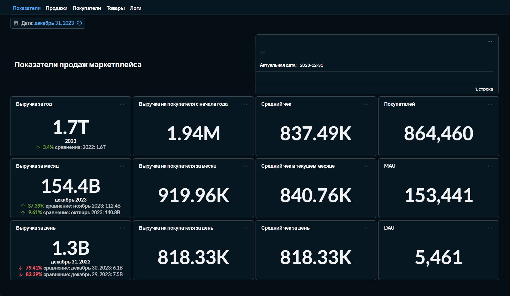
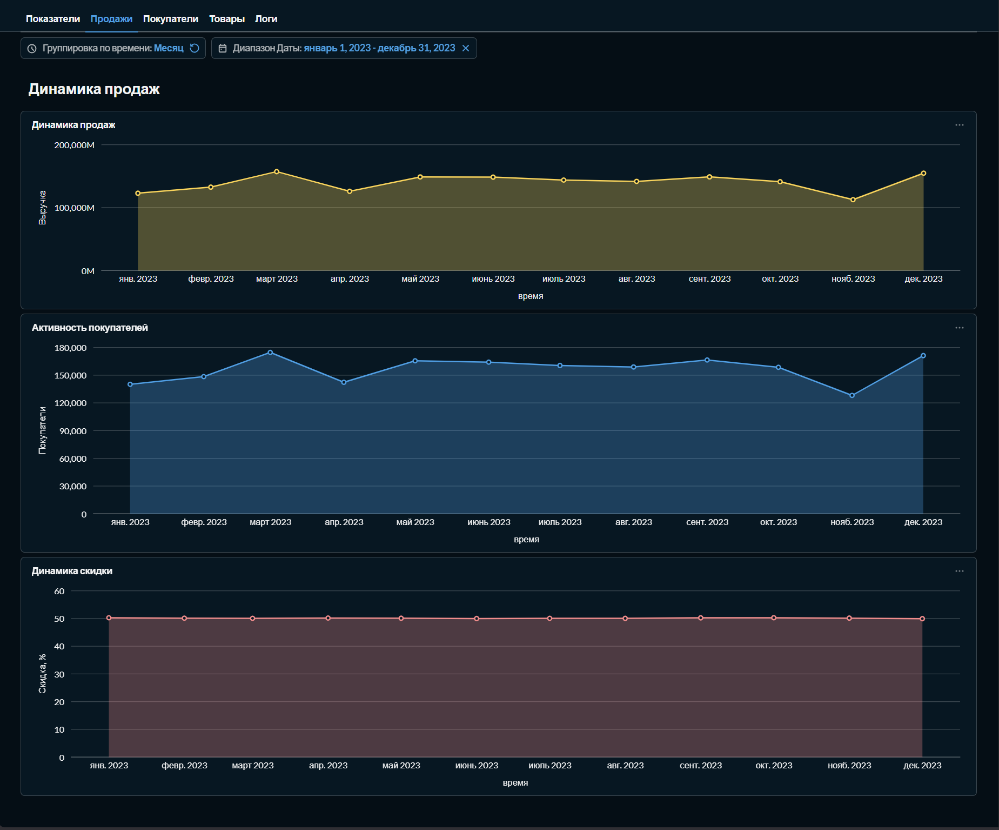
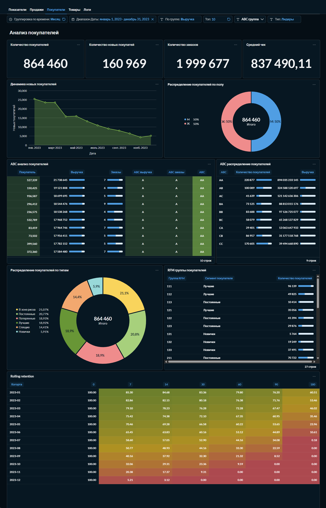
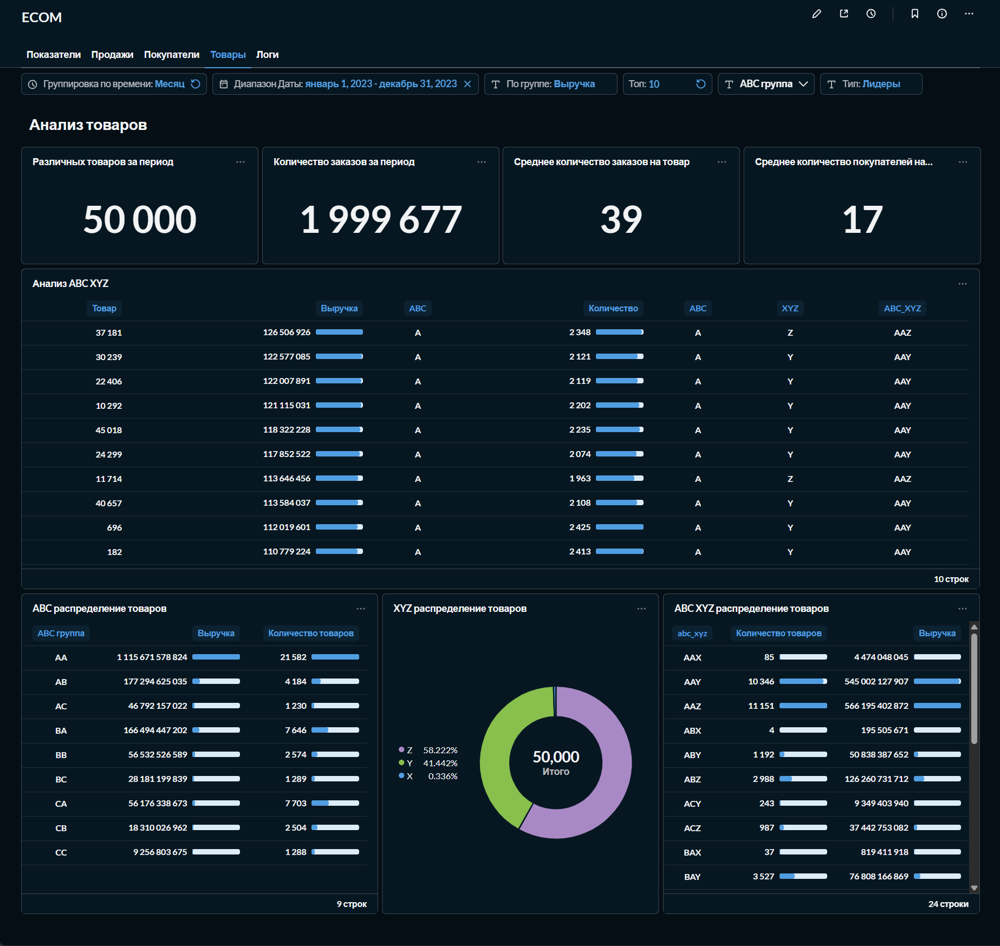
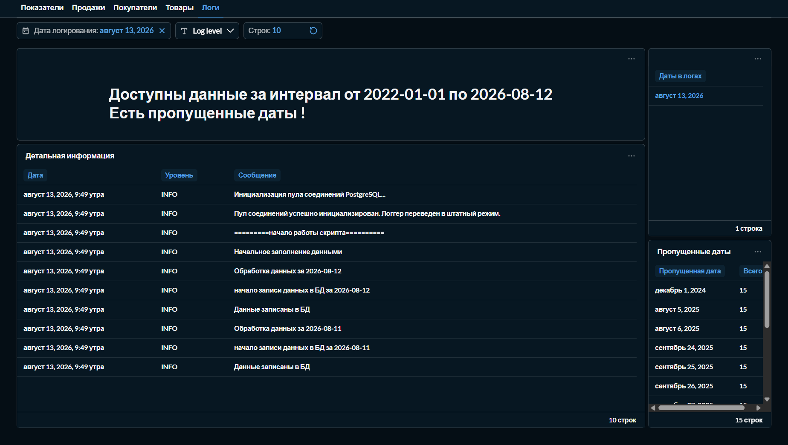

# Анализ продаж маркетплейса / дашборд в Metabase

В проекте реализована автоматизация сбора данных продаж по API, хранение в СУБД PostreSQL и визуализация метрик в Metabase.
Цель - оперативное отслеживание основных метрик по активности клиентов, ассортиментной матрицы и продажам для принятия решений по оптимизации работы с покупателями, ассортиментной матрицей.

## Описание задачи
Вам предстоит работать с информацией о продажах крупного онлайн-маркетплейса (формата Озон). 
Вам будет доступна информация о всех покупках с подробной статистикой: дата-время, информация о клиенте, информация о товаре, информация о скидках и так далее.
Информация будет доступна вам по API. Формат данных и ограничение запросов вам заранее неизвестны - поставщик услуг сообщил лишь адрес и параметры для отправки запроса. 
Доступ к API:
* Эндпоинт для получения данных: `http://final-project.simulative.ru/data`
* API отдает данные только за один день. Дата передается в виде параметра формата yyyy-mm-dd.

Требуется сделать:
* Насписать скрипт, для сбора данных по API. 
* Настроить сервер и развернуть на нем базу данных для хранения информации.
* Настроить скрипт, чтобы он ежедневно в 7 утра забирал данные за предыдущий день.
* Единоразово написать и запустить скрипт, который первично заполнит базу всеми историческими данными, которые уже доступны в API на момент написания вашего скрипта.
* Установить Metabase, подключить его к вашей базе и собрать дашборд для оперативного отслеживания основных метрик по активности клиентов, ассортиментной матрицы, продажам и так далее.
* Провести 2 исследования на основании данных за 2023 год: 
  - Оптимизация ассортиментной матрицы, увеличение кол-ва продаж некоторых товаров, вывод их из ассортимента или увеличение их маржинальности. 
  - Работа с клиентской базой. Как увеличить LTV? Какие метрики нужно увеличивать, стоит ли их увеличивать вообще и как их увеличивать, чтобы работать с существующей клиентской базой более эффективно?


## Сруктура файлов
```sh
DA_FP/
├── README.MD                  # документация
├── docker-compose.yml         # файл конфигурации для сборки всего проекта в docker
│
├── init-scripts/              # скрипты для настройки postgreSQL при сборке контейнера
│   ├── 01-init-db.sh          # скрипт создания БД для выгрузки данных по API и БД для metabase
│   ├── 03-init_metabase.sql   # скрипт с дашбордом metabase
│   └── 04-db-init-done.sh     # скрипт завершения начальной загрузки данных в БД (для контроля финальной инициализации контейнера БД)
│
├── py-app/                    # папка с приложением на Python для работы с API и выгрузкой данных в БД
│   ├── crontab                # настройки планировщика cron для автоматизации выгрузки 
│   ├── Dockerfile             # файл для сборки контейнера приложения на python
│   ├── entrypoint.sh          # скрипт при старте контейнера 
│   ├── main.py                # сбор данных по API и запись в БД
│   ├── requirements.txt       # файл требуемых библитек
│   │
│   ├── ecom/                  # папка с описанием классов для основного приложения
│   │   ├── api.py             # класс для работы с API
│   │   ├── db.py              # класс для работы с БД
│   │   └── log.py             # класс для логирования результатов работы 
│   │
│   └── log/                   # 
│       └── fatalerror.log     # лог фатальных ошибок
│
├── analysis/                  # папка с исследованием 
│   ├── Analysis.ipynb         # jupyter notebook с исследованиями товаров и продаж
│   ├── params.yaml            # параметры для подключения к БД
│   └── Анализ ассортимента и продаж.pdf   # результаты исследования
│
├── .env                       # конфигурационный файл (скрыт)
├── env                        # пример конфигурационного файла
└── .venv/                     # виртуальное окружение python (скрыто)

```

## Описание проекта
Проект реализован с использованием Docker.
Создаются 3 контейнера - `docker-compose.yml`:
1) контейнер с СУБД Postgres, в котором реализовано хранение данных выгруженных по API, логирование работы приложения выгрузки данных, а также БД для metabase;
   * в папке init-scripts содержатся скрипты создания БД для приложения на python и логирования, а также создания БД для metabase - `01-init-db.sh`;
   * скрипт для копирования готового дашборда metabase  - `03-init_metabase.sql`;
   * скрипт завершения готовности БД к работе - `04-db-init-done.sh`, используется для проверки готовности БД и препятствует запуск контейнеров с metabase и python до готовности БД.
2) контейнер с приложением на python для выгрузки данных по API и планировщиком cron для автоматической ежедневной выгрузки данных;
   * при запуске контейнера проверяется наличие данных в БД и при их отсутствии происходит начальное заполнение данных;
   * планировщик cron в контейнере обеспечивает сбор данных каждый день в 7 утра - `0 7 * * * /usr/local/bin/python /app/main.py >> /var/log/cron.log 2>&1`;
   * ежедневно происходит загрузка данных за предыдущий день, а также проверка пропущенных дат и в случае наличия пропусков повторный сбор данных за пропущенные даты;
   * логирование всех действий записывается в БД, производится очистка логов старше 30 дней и освобождение свободного места в БД `vacuum full ecom.logs`.
3) контейнер с metabase.

### Установка и запуск
1. перейти в домашнюю папку 
    * `cd ~`

2. скопировать репозиторий git
```bash
git clone https://github.com/krutse/DA_FP.git
cd ./DA_FP
```

3. Скопировать пример конфигурационного файла env в .env и задать пользователей и пароли  \
`cp env .env`

#### Пример настройки конфигурационного файла .env

```
# PostgreSQL настройки
POSTGRES_USER=<имя администратора БД>
POSTGRES_PASSWORD=<пароль администратора БД>
POSTGRES_PORT=15432  # порт postgreSQL для подключения к БД снаружи контейнера
POSTGRES_HOST=localhost   # не меняем 

# python app
APP_HOST=postgres # <-- имя хоста (из docker compose) при подключении psycopg2
APP_USER=<имя пользователя для работы с БД с данными продаж>
APP_USER_PASSWORD=<пароль пользователя для работы с БД с данными продаж>
APP_DB=ecom #<имя БД с данными продаж>
DB_SCHEMA=ecom #<схема для БД с данными продаж>

# Metabase настройки
METABASE_DB=<имя БД для metabase>
METABASE_PORT=13000  # порт metabase для подключения снаружи контейнера

# Python приложение
LOG_LEVEL=INFO 
LOG_DAYS=30
API_URL=http://final-project.simulative.ru/data

```


4. Создать и запустить контейнеры командой: \
 `docker compose up -d --build `


### Описание таблиц
Для хранения выгруженных по API данных создана БД ecom со схемой ecom.

Данные по продажам сохраняются в таблицу `sales_details`

#### Описание таблицы `ecom.sales_details`

```sql
CREATE TABLE ecom.sales_details (
	id serial4 NOT NULL,
	client_id int4 NULL,
	gender bpchar(1) NULL,
	purchase_datetime date NULL,
	purchase_time_as_seconds_from_midnight int4 NULL,
	product_id int4 NULL,
	quantity int4 NULL,
	price_per_item numeric(12, 2) NULL,
	discount_per_item numeric(12, 2) NULL,
	total_price numeric(12, 2) NULL,
	CONSTRAINT sales_details_pkey PRIMARY KEY (id)
);
```

Таблица предназначена для хранения **детализированной информации о продажах** в разрезе отдельных товаров, клиентов и временных меток внутри схемы `ecom`.

##### Спецификация таблицы

* **Схема:** `ecom`
* **Название таблицы:** `sales_details`
* **Первичный ключ:** `id` (Суррогатный)

##### Структура полей 

| Имя поля | Тип данных | Обязательное (Not Null) | Описание / Назначение | Пример / Примечание |
| :--- | :--- | :---: | :--- | :--- |
| **`id`** | `serial4` | `Да` | Уникальный идентификатор записи | Автоинкремент (Первичный ключ) |
| **`client_id`** | `int4` | `Нет` | Идентификатор покупателя | Ссылка на таблицу клиентов |
| **`gender`** | `bpchar(1)` | `Нет` | Пол клиента | Строка фиксированной длины (`M`/`F`) |
| **`purchase_datetime`** | `date` | `Нет` | Дата совершения покупки | Формат: `YYYY-MM-DD` |
| **`purchase_time_as_seconds_from_midnight`** | `int4` | `Нет` | Время покупки в секундах от полуночи | Используется для аналитики времени суток |
| **`product_id`** | `int4` | `Нет` | Идентификатор проданного товара |   |
| **`quantity`** | `int4` | `Нет` | Количество выкупленного товара |   |
| **`price_per_item`** | `numeric(12, 2)` | `Нет` | Исходная цена за одну единицу товара | Точный денежный тип |
| **`discount_per_item`** | `numeric(12, 2)` | `Нет` | Размер скидки на одну единицу товара | Точный денежный тип |
| **`total_price`** | `numeric(12, 2)` | ` Нет` | Итоговая стоимость позиции с учетом скидки | Расчетное поле: `(price - discount) * quantity` |

#####  Ограничения (Constraints)

* **`sales_details_pkey`**: Ограничение первичного ключа (`PRIMARY KEY`) по колонке `id`.

##### Особенности архитектуры
1. **Анализ времени:** Время покупки сохраняется как количество секунд от полуночи (`purchase_time_as_seconds_from_midnight`). 
2. **Финансовая точность:** Для полей стоимости используется тип `numeric(12, 2)`, что предотвращает ошибки округления, свойственные типам с плавающей точкой (`float`).

#### Описание таблицы `ecom.logs`

```sql
CREATE TABLE ecom.logs (
	id serial4 NOT NULL,
	"date" timestamp DEFAULT CURRENT_TIMESTAMP NULL,
	"level" text NULL,
	message text NULL,
	CONSTRAINT logs_pkey PRIMARY KEY (id)
);
```

Таблица предназначена для **логирования системных событий**, ошибок и информационных сообщений процессов в схеме `ecom`.

##### Спецификация таблицы

* **Схема:** `ecom`
* **Название таблицы:** `logs`
* **Первичный ключ:** `id` (Суррогатный)

##### Структура полей (Словарь данных)

| Имя поля | Тип данных | Обязательное (Not Null) | Значение по умолчанию | Описание / Назначение |
| :--- | :--- | :---: | :--- | :--- |
| **`id`** | `serial4` | `Да` | *Автоинкремент* | Уникальный идентификатор записи лога |
| **`date`** | `timestamp` | `Нет` | `CURRENT_TIMESTAMP` | Дата и время фиксации события |
| **`level`** | `text` | `Нет` | `NULL` | Уровень лога (например: `INFO`, `WARN`, `ERROR`) |
| **`message`** | `text` | `Нет` | `NULL` | Текст системного сообщения или стек ошибки |

##### Ограничения (Constraints)

* **`logs_pkey`**: Ограничение первичного ключа (`PRIMARY KEY`) по колонке `id`.

#####  Особенности архитектуры
1. **Автоматическое время:** Поле `"date"` автоматически заполняется текущим временем сервера (`CURRENT_TIMESTAMP`), если оно не передано явно.
2. **Гибкость текста:** Использование типа `text` для полей `"level"` и `message` позволяет записывать сообщения и стеки ошибок любой длины без риска обрезки данных.

####  Описание представления `ecom.v_calendar`

```sql
CREATE OR REPLACE VIEW ecom.v_calendar
AS SELECT d::date AS calendar_date,
    EXTRACT(year FROM d)::integer AS year,
    EXTRACT(quarter FROM d)::integer AS quarter,
    EXTRACT(month FROM d)::integer AS month,
    EXTRACT(day FROM d)::integer AS day,
    EXTRACT(week FROM d)::integer AS week_of_year,
    EXTRACT(isodow FROM d)::integer AS day_of_week,
    to_char(d, 'TMDay'::text) AS day_name,
    to_char(d, 'TMMonth'::text) AS month_name,
        CASE
            WHEN EXTRACT(isodow FROM d) = ANY (ARRAY[6::numeric, 7::numeric]) THEN true
            ELSE false
        END AS is_weekend
   FROM generate_series((( SELECT min(sales_details.purchase_datetime) AS min
           FROM ecom.sales_details))::timestamp with time zone, (( SELECT max(sales_details.purchase_datetime) AS max
           FROM ecom.sales_details))::timestamp with time zone, '1 day'::interval) d(d);
```

Это **динамическое календарное представление (Date Dimension)** в схеме `ecom`. Оно автоматически генерирует непрерывную последовательность дат и их календарных атрибутов (год, месяц, день недели и т.д.) для аналитики и построения отчетов временных рядов.

#####  Спецификация

* **Схема:** `ecom`
* **Название объекта:** `v_calendar`
* **Тип объекта:** Представление (`VIEW`)
* **Базовая таблица:** `ecom.sales_details` (используется для определения временных границ каледаря)

##### Структура полей

| Имя поля | Тип данных | Описание / Назначение | Пример значения |
| :--- | :--- | :--- | :--- |
| **`calendar_date`** | `date` | Дата календаря (уникальный ключ строки) | `2026-08-13` |
| **`year`** | `integer` | Календарный год | `2026` |
| **`quarter`** | `integer` | Номер квартала (1–4) | `3` |
| **`month`** | `integer` | Номер месяца (1–12) | `8` |
| **`day`** | `integer` | День месяца (1–31) | `13` |
| **`week_of_year`** | `integer` | Номер недели в году (1–53) | `33` |
| **`day_of_week`** | `integer` | День недели по стандарту ISO (1 — Понедельник, 7 — Воскресенье) | `4` |
| **`day_name`** | `text` | Полное название дня недели на языке СУБД | `Четверг` / `Thursday` |
| **`month_name`** | `text` | Полное название месяца на языке СУБД | `Август` / `August` |
| **`is_weekend`** | `boolean` | Флаг выходного дня (`true` для субботы и воскресенья, иначе `false`) | `false` |

##### Логика работы и особенности

1. **Динамический диапазон**: Представление не имеет фиксированных границ. С помощью функции `generate_series` оно автоматически расширяется на основе данных о продажах:
   * **Старт:** Минимальная дата покупки (`min(purchase_datetime)`) из таблицы `ecom.sales_details`.
   * **Финиш:** Максимальная дата покупки (`max(purchase_datetime)`) из той же таблицы.
   * **Шаг:** 1 день (`'1 day'::interval`).
2. **Локализация (`TM` префикс)**:  Для полей `day_name` и `month_name` используется модификатор `TM` (Translation Mode) в функции `to_char`. Это значит, что названия дней и месяцев будут автоматически выводиться на том языке, который настроен в параметрах локали вашей базы данных (например, `lc_time`).
3. **Флаг выходных**: Поле `is_weekend` вычисляется через конструкцию `CASE WHEN EXTRACT(isodow FROM d) = ANY (ARRAY[6, 7])`. Проверка идет строго по ISO-дням (6 — суббота, 7 — воскресенье).


#### Описание представления `ecom.v_sales_data`

```sql
CREATE OR REPLACE VIEW ecom.v_sales_data
AS WITH dates AS (
         SELECT min(sales_details.calendar_date) AS min_date,
            max(sales_details.calendar_date) AS max_date
           FROM ecom.v_calendar sales_details
        ), periods AS (
         SELECT g.generated_date::date AS generated_date
           FROM dates,
            LATERAL generate_series(dates.min_date::timestamp with time zone, dates.max_date::timestamp with time zone, '1 day'::interval) g(generated_date)
        ), products AS (
         SELECT sales_details.product_id
           FROM ecom.sales_details
          WHERE sales_details.quantity > 0
          GROUP BY sales_details.product_id
        ), grid AS (
         SELECT p.product_id,
            g.generated_date AS purchase_datetime,
            0 AS ni,
            0 AS qty
           FROM products p
             CROSS JOIN periods g
        )
 SELECT grid.product_id,
    grid.purchase_datetime,
    grid.ni,
    grid.qty
   FROM grid
UNION ALL
 SELECT sd.product_id,
    sd.purchase_datetime,
    sd.total_price AS ni,
    sd.quantity AS qty
   FROM ecom.sales_details sd
  WHERE sd.quantity > 0;
```

Представление служит основой для XYZ анализа.

Главная цель этого представления — **борьба с «пропусками данных»**. 

Если товар не продавался в определенный день, в обычной таблице продаж этой даты для товара просто не будет. Данное представление гарантирует, что в BI-системе или отчете для каждого товара на каждый день календаря будет как минимум одна строка (хотя бы нулевая). 


##### Спецификация

* **Схема:** `ecom`
* **Название объекта:** `v_sales_data`
* **Тип объекта:** Представление (`VIEW`)
* **Базовые объекты:** 
  * `ecom.v_calendar` (источник дат)
  * `ecom.sales_details` (источник продуктов и реальных продаж)

##### Структура полей

| Имя поля | Тип данных | Описание / Назначение | Пример значения |
| :--- | :--- | :--- | :--- |
| **`product_id`** | `integer` | Идентификатор товара | `1042` |
| **`purchase_datetime`** | `date` | Дата (периода или реальной покупки) | `2026-08-13` |
| **`ni`** | `numeric(12, 2)` / `numeric` | Выручка | `0.00` или `1450.50` |
| **`qty`** | `integer` | Количество проданного товара | `3` |


### Metabase (описание дашборда и примеры визуализации)
Дашборд состоит из 5 страниц:

* Показатели

Выводится информация об общей выручке, выручке на покупателя, средний чек и количество покупателей за год, месяц и день

Призводится проверка что выбранная дата отчёта входит в диапазон дат в базе данных. Если дата выходит за диапазон то отчёт строится на последнюю доступную дату. Актуальная дата отчёта отображается в правой верхней карточке.



* Продажи

Выводится инфрация о динамике продаж за выбранный диапазон дат, возможна следующая группировка: день, неделя, месяц, квартал, год




* Покупатели

Выводится информация о количестве покупателей, количестве новых покупателей, количестве заказов и среднем чеке за выбранный период времени

Отображается динамика привлечения новых покупателей

Распределение покупателей по полу

ABC и RFM анализ покупателей.




* Товары

Выводится информация о количестве различных проданных товаров, количестве заказов, среднем количестве заказов на товар, среднем количестве покупателей на товар за выбранный период времени.

ABC и XYZ анализ по товарам



* Логи

Выводится информация о интервале времени данных доступных для анализа, отображается информация о пропущенных датах.

Выводится детальная информация логов.



### Доступ к БД, доступ к дашборду
* Доступ к БД
  - Тип: PostgreSQL 
  - IP: `xxx.xxx.xxx.xxx` 
  - Порт: `15432` 
  - База: `ecom` 
  - Пользователь: `user1` 
  - Пароль: `user1` 
  - Права: только чтение

[Ссылка на дашборд]()

## Проведение исследований
Проведено исследование по товарам и покупателям на основе данных за 2023 год.

Файл с исследованиями: [Analysis.ipynb](analysis/Analysis.ipynb)

Файл с результатами анализа: [Анализ ассортимента и продаж.pdf](<analysis/Анализ ассортимента и продаж.pdf>)


