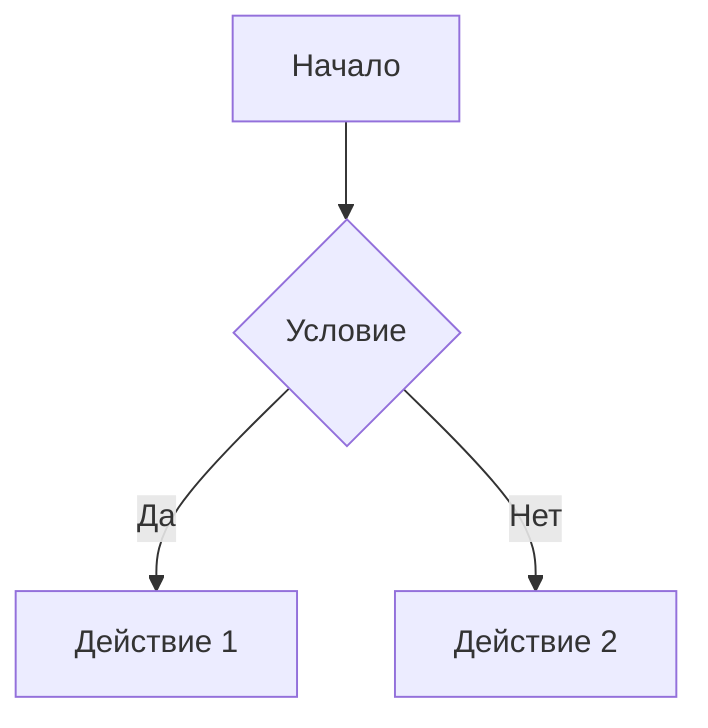

# Анализ продаж маркетплейса / дашборд в Metabase

В проекте реализована автоматизация сбора данных продаж по API, хранение в СУБД PostreSQL и визуализация метрик в Metabase.
Цель - оперативное отслеживание основных метрик по активности клиентов, ассортиментной матрицы и продажам для принятия решений по оптимизации работы с покупателями, ассортиментной матрицей.

## Описание задачи
Вам предстоит работать с информацией о продажах крупного онлайн-маркетплейса (формата Озон). 
Вам будет доступна информация о всех покупках с подробной статистикой: дата-время, информация о клиенте, информация о товаре, информация о скидках и так далее.
Информация будет доступна вам по API. Формат данных и ограничение запросов вам заранее неизвестны - поставщик услуг сообщил лишь адрес и параметры для отправки запроса. 
Доступ к API:
* Эндпоинт для получения данных: http://final-project.simulative.ru/data
* API отдает данные только за один день. Дата передается в виде параметра формата yyyy-mm-dd.

Требуется сделать:
* Насписать скрипт, для сбора данных по API. 
* Настроить сервер и развернуть на нем базу данных для хранения информации.
* Настроить скрипт, чтобы он ежедневно в 7 утра забирал данные за предыдущий день.
* Единоразово написать и запустить скрипт, который первично заполнит базу всеми историческими данными, которые уже доступны в API на момент написания вашего скрипта.
* Установить Metabase, подключить его к вашей базе и собрать дашборд для оперативного отслеживания основных метрик по активности клиентов, ассортиментной матрицы, продажам и так далее.
* Провести 2 исследования на основании данных за 2023 год: 
  -- Оптимизация ассортиментной матрицы, увеличение кол-ва продаж некоторых товаров, вывод их из ассортимента или увеличение их маржинальности. 
  -- Работа с клиентской базой. Как увеличить LTV? Какие метрики нужно увеличивать, стоит ли их увеличивать вообще и как их увеличивать, чтобы работать с существующей клиентской базой более эффективно?


## Сруктура файлов
```sh
DA_FP/
├── README.MD                  # документация
├── docker-compose.yml         # файл конфигурации для сборки всего проекта в docker
│
├── init-scripts/              # скрипты для настройки postgreSQL при сборке контейнера
│   ├── 01-init-db.sh          # скрипт создания БД для выгрузки данных по API и БД для metabase
│   ├── 02-add-view.sql        # скрипт добавление view в основную БД
│   ├── 03-init_metabase.sql   # скрипт с дашбордом metabase
│   └── 04-db-init-done.sh     # скрипт завершения начальной загрузки данных в БД (для контроля финальной инициализации контейнера БД)
│
├── py-app/                    # папка с приложением на Python для работы с API и выгрузкой данных в БД
│   ├── crontab                # настройки планировщика cron для автоматизации выгрузки 
│   ├── Dockerfile             # файл для сборки контейнера приложения на python
│   ├── entrypoint.sh          # скрипт при старте контейнера 
│   ├── main.py                # сбор данных по API и запись в БД
│   ├── requirements.txt       # файл требуемых библитек
│   │
│   ├── ecom/                  # папка с описанием классов для основного приложения
│   │   ├── api.py             # класс для работы с API
│   │   ├── db.py              # класс для работы с БД
│   │   └── log.py             # класс для логирования результатов работы 
│   │
│   └── log/                   # 
│       └── fatalerror.log     # лог фатальных ошибок
│
├── .env                       # конфигурационный файл (скрыт)
├── env                        # пример конфигурационного файла
└── .venv/                     # виртуальное окружениу python (скрыто)

```

## Описание проекта
Проект реализован с использованием Docker.
Создаются 3 контейнера:
1) контейнер с СУБД Postgres, в котором реализовано хранение данных выгруженных по API, логирование работы приложения выгрузки данных, а также БД для metabase;
2) контейнер с приложением на python для выгрузки данных по API и планировщиком cron для автломатической ежедневной выгрузки данных;
3) контейнер с metabase.

### Установка и запуск
1. перейти в домашнюю папку 
    * `cd ~`

2. скопировать репозиторий git
```bash
git clone https://github.com/krutse/DA_FP.git
cd ./DA_FP
```

3. Скопировать пример конфигурационного файла env в .env и задать пользователей и пароли
`cp env .env`

#### Пример настройки конфигурационного файла .env

```
# PostgreSQL настройки
POSTGRES_USER=<имя администратора БД>
POSTGRES_PASSWORD=<пароль администратора БД>
POSTGRES_PORT=15432  # порт postgreSQL для подключения к БД снаружи контейнера
POSTGRES_HOST=localhost   # не меняем 

# python app
APP_HOST=postgres # <-- имя хоста (из docker compose) при подключении psycopg2
APP_USER=<имя пользователя для работы с БД с данными продаж>
APP_USER_PASSWORD=<пароль пользователя для работы с БД с данными продаж>
APP_DB=ecom #<имя БД с данными продаж>
DB_SCHEMA=ecom #<схема для БД с данными продаж>

# Metabase настройки
METABASE_DB=<имя БД для metabase>
METABASE_PORT=13000  # порт metabase для подключения снаружи контейнера

# Python приложение
LOG_LEVEL=INFO 
LOG_DAYS=30
API_URL=http://final-project.simulative.ru/data

```


4. Создать и запустить контейнеры командой:
    * docker compose up -d --build


#### Описание таблиц


### Metabase (описание дашборда и примеры визуализации)


### Доступ к БД, доступ к дашборду


## Проведение исследований


**Пример диаграммы** 
